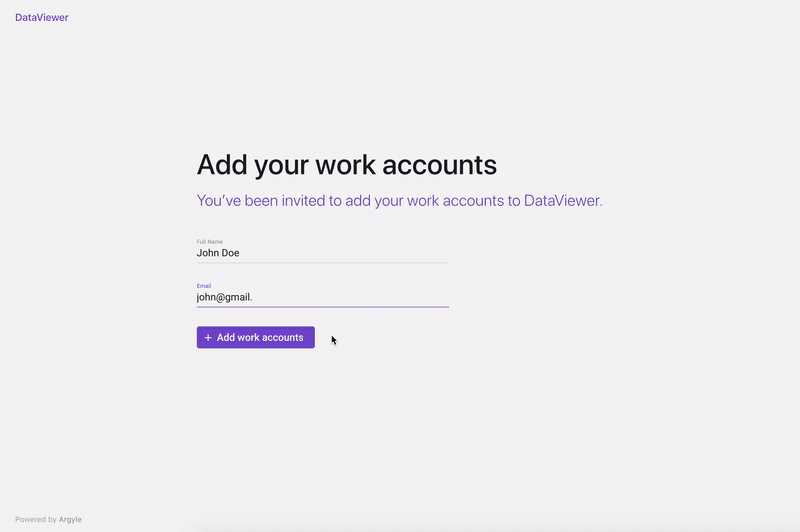
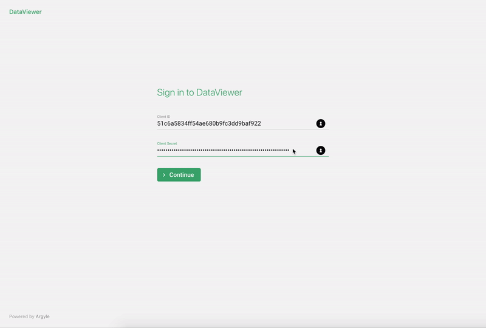
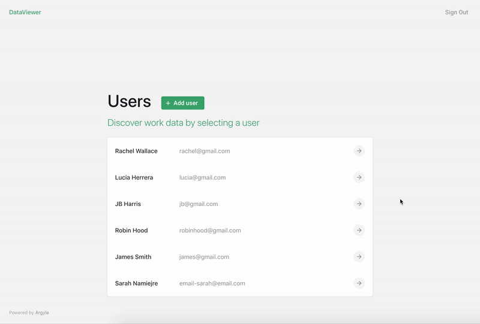

# Argyle Data Viewer

Argyle Data Viewer app covers all possible endpoints you can access from Argyle API. [Argyle Docs](https://argyle.io/docs/api-reference)

## Features

### :space_invader: [Usage of the Link](https://argyle.io/docs/argyle-link/overview)

When running locally you can add users visiting `http://localhost:3000/start`. Full name and email is required so the user reference can be saved in the database. User can choose work accounts he/she works for and connect using his/her credentials. When connecting the first account, a new `userId` is generated and stored in the firebase database. This `id` is used in seperate user view to call API endpoints for getting all neccessary data.

<details open><summary>Link Demo</summary>
<br>
  <p align="center">
    
  </p>
</details>

### :lock: [Authentication](https://argyle.io/docs/api-reference/authentication)

Use `client_id` and `client_secret` to Sign in. These keys can be found in [Argyle Console](https://console.argyle.io). Authentication is needed to access and use all protected API endpoints, these keys are set in HTTP request `auth` headers.
<br>
<br>

<details open><summary>Sign In / Sign Out Demo</summary>
<br>
  <p align="center">
    
  </p>
</details>

### :raising_hand: User View

When signed in you can access all connected users data from firebase. The `userId` stored in firebase is used to call API requests for each user individually, for example [list all accounts](https://argyle.io/docs/api-reference/accounts/list-accounts) for the user.

<details open><summary>User Demo</summary>
<br>
  <p align="center">
    
  </p>
</details>

---

> This project was bootstrapped with [Create React App](https://github.com/facebook/create-react-app).

## How to set up the app locally:

#### Create and Setup Firebase project

Firebase is used in this project to store user ids, full name and email in the user list, so the users added to this app only would be displayed in the list.

- Go to https://console.firebase.google.com
- Click `Add Project` button
- Add project name, follow the steps displayed
- Under 'Get started by adding Firebase to your app..' choose `Web` icon, create web project
- Add a name to the Project
- Save the API keys (you can find them later in project settings)

```
  var firebaseConfig = {
    apiKey: "example-api-key",
    authDomain: "example-domain.firebaseapp.com",
    databaseURL: "https://example-urk.firebaseio.com",
    projectId: "example-id",
    storageBucket: "example-bucket-id",
    messagingSenderId: "example-sender-id",
    appId: "example-app-id",
    measurementId: "example-measurement-id"
  };
```

#### Rename `.env.example` to `.env` in the root folder:

#### Add the keys in `.env` file in the root folder:

```
REACT_APP_API_URL=https://api.argyle.io/v1
REACT_APP_FIREBASE_API_KEY=
REACT_APP_FIREBASE_DATABASE_URL=
REACT_APP_FIREBASE_AUTH_DOMAIN=
REACT_APP_FIREBASE_PROJECT_ID=
REACT_APP_PLUGIN_KEY=
```

- `REACT_APP_FIREBASE_API_KEY`, `REACT_APP_FIREBASE_DATABASE_URL`, `REACT_APP_FIREBASE_AUTH_DOMAIN`, `REACT_APP_FIREBASE_PROJECT_ID`- use 'apiKey, databaseURL, authDomain, projectId' which you retrieved from firebase setup (or settings in your created app).
- `REACT_APP_PLUGIN_KEY` - go to https://console.argyle.io and copy the `plugin_key` value from API Keys, the `client_id` and `client_secret` keys will be used for signing in.

## Start the app:

Run:

#### `npm install`

Installs all the dependencies for the project.

#### `npm start`

Runs the app in the development mode.
Open [http://localhost:3000](http://localhost:3000) to view it in the browser.

The page will reload if you make edits.
You will also see any lint errors in the console.

#### `npm run build`

Builds the app for production to the `build` folder.
It correctly bundles React in production mode and optimizes the build for the best performance.
re
The build is minified and the filenames include the hashes.
Your app is ready to be deployed!

See the section about [deployment](https://facebook.github.io/create-react-app/docs/deployment) for more information.

#### `firebase deploy`

Run this command to deploy the app on firebase. `npm run build` should be run before that.
For this to work you need to install firebase tools globally
`npm install -g firebase-tools`
