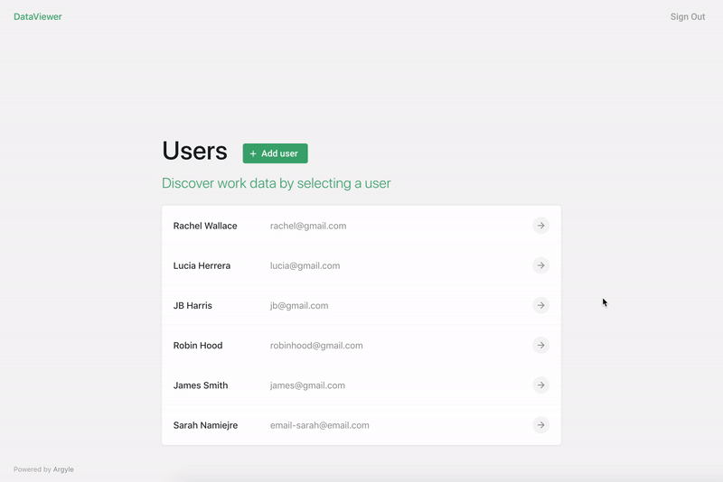

# Argyle Data Viewer

Argyle Data Viewer example app covers most of the endpoints you can access in the [Argyle API](https://argyle.io/docs/api-reference). Using the data received from each of these endpoints we created a visual representation of how to integrate it into your app in a simple way. It covers both [Argyle API](https://argyle.io/docs/api-reference) and [Argyle Link](https://argyle.io/docs/argyle-link/overview) integration.
<br>
<br>
Argyle Data Viewer uses [Firebase Realtime Database](https://firebase.google.com/docs/database) to store data. Given you use the same database configuration, and the `plugin_key` (using the same `plugin_key`) can be run multiple instances of the app on different devices.

## Features

### :space_invader: [Usage of the Link](https://argyle.io/docs/argyle-link/overview)

When running locally, you can add new users to the data viewer by visiting `http://localhost:3000/start`. **Full name** and **email** are required to have the user reference saved in the database. User can choose the work platforms they want to connect and login with their credentials. When connecting the first account, a new `userId` is generated and stored in the firebase database. This `id` is used in a seperate user view to call the API endpoints for getting all neccessary data.

<details open><summary>Link Demo</summary>
<br>
  <p align="center">
    
  </p>
</details>

### :lock: [Authentication](https://argyle.io/docs/api-reference/authentication)

To sign in use `client_id` and `client_secret` that you can find in [Argyle's Console](https://console.argyle.io). Authentication is needed to access and use all protected API endpoints, these keys are set in HTTP request `auth` headers.
<br>
<br>

<details open><summary>Sign In / Sign Out Demo</summary>
<br>
  <p align="center">
    
  </p>
</details>

### :raising_hand: User View

When signed in you can access the data of all the users that shared their data with you by connecting their work accounts. The `userId` stored in firebase is used to make API requests for each user individually. For example, [list all accounts](https://argyle.io/docs/api-reference/accounts/list-accounts) is invoked to get a list of all connected work plaforms for the user.

<details open><summary>User Demo</summary>
<br>
  <p align="center">
    
  </p>
</details>

---

> This project was bootstrapped with [Create React App](https://github.com/facebook/create-react-app). ⚛️

## How to set up and run the app locally:

### Create and set up a project in [Firebase](https://firebase.google.com/docs/web/setup)

Firebase is used in this project to store `userId`, `fullName` and `email` for each user in the user list. As mentioned above `userId` is neccessary to fetch data for each user individually. For example [list profiles](https://argyle.io/docs/api-reference/profiles/list-profiles).
<br>

#### Steps for creating a Firebase project:

- Go to [Firebase Console](https://console.firebase.google.com)
- Click **Add Project** button
- Add your project name, follow the steps displayed.
- Under _Get started by adding Firebase to your app.._ choose **Web** icon and create a web project
- Add a name for the Project
- Save the API keys (you can find them later in the project settings)

```js
var firebaseConfig = {
  apiKey: 'example-api-key',
  authDomain: 'example-domain.firebaseapp.com',
  databaseURL: 'https://example-urk.firebaseio.com',
  projectId: 'example-id',
  storageBucket: 'example-bucket-id',
  messagingSenderId: 'example-sender-id',
  appId: 'example-app-id',
  measurementId: 'example-measurement-id',
}
```

#### Rename `.env.example` to `.env` in the root folder:

#### Add the keys in `.env` file in the root folder:

```
REACT_APP_API_URL=https://api.argyle.io/v1
REACT_APP_FIREBASE_API_KEY=
REACT_APP_FIREBASE_DATABASE_URL=
REACT_APP_FIREBASE_AUTH_DOMAIN=
REACT_APP_FIREBASE_PROJECT_ID=
REACT_APP_PLUGIN_KEY=
```

- `REACT_APP_FIREBASE_API_KEY`, `REACT_APP_FIREBASE_DATABASE_URL`, `REACT_APP_FIREBASE_AUTH_DOMAIN`, `REACT_APP_FIREBASE_PROJECT_ID`- use _apiKey, databaseURL, authDomain, projectId_ which you retrieved from firebase setup (or settings in your created app).
- `REACT_APP_PLUGIN_KEY` - go to [Argyle Console](https://console.argyle.io) and copy the `plugin_key` value from API Keys, the `client_id` and `client_secret` keys will be used for signing in.

## Start the app:

Run:

#### `npm install`

Installs all the dependencies for the project.

#### `npm start`

Runs the app in the development mode.
Open [http://localhost:3000](http://localhost:3000) to view it in the browser.

The page will reload if you make edits.
You will also see any lint errors in the console.

#### `npm run build`

Builds the app for production to the `build` folder.
It correctly bundles React in production mode and optimizes the build for the best performance.
re
The build is minified and the filenames include the hashes.
Your app is ready to be deployed!

See the section about [deployment](https://facebook.github.io/create-react-app/docs/deployment) for more information.

#### `firebase deploy`

Run this command to deploy the app on firebase. `npm run build` should be run before that.
For this to work you need to install firebase tools globally
`npm install -g firebase-tools`
